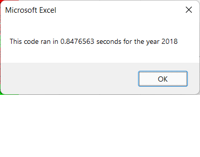
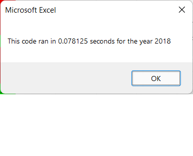

# stock-analysis
# Overview of Project
In order to make a little more research, the project will expand the dataset to include the entire stock market over the last few years to work well for thousands of stocks in a short time execute. Therefore, the aim of this project is to determine whether refactoring the code succesfully made the VBA script run faster
# Results
 
 
The first picture represents represents the run time of code before refactoring and the second picture represents the runtime of code after refactoring. As expected, the runtime improved with refactoring. 
# Summary
The refactoring proccess allows to get the total Daily Volumes and Retunrns for each kind of tickers in a shorter time. A possible disadvantage is that could be difficult to know how much will runtime improved before start working in the refactoring code
The original code is an important first glance of the code to know the purpose of the task  and the objective. It allows to define the keychanges in order to avoid wasting time rewriting useful code made before. In refactored VBA script, it is key to consider the differences between arrays and variables to avoid errors in loops.
